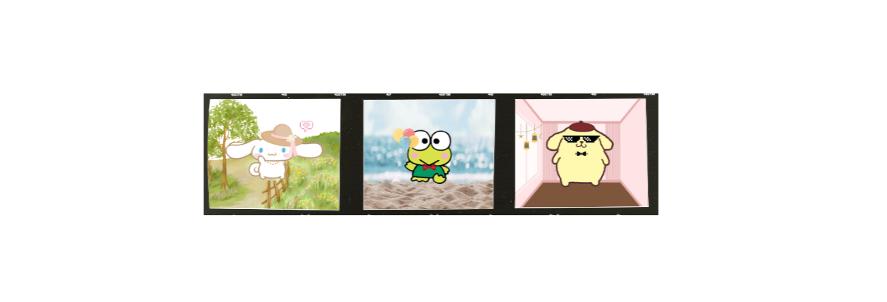

# Sanrio-Inspired Dress-Up Game

Welcome to my **Sanrio-style interactive dress-up game**!  
This web-based project allows users to:

- Select a cute cartoon character
- Customize their look with drag-and-drop accessories
- Choose a background scene
- Download a snapshot of their styled character

 


## Features

- **Character Selection** – Scroll through and pick from Sanrio-style characters.
- **Drag-and-Drop Accessories** – Style your character with headwear, neckwear, and decorations.
- **Background Switching** – Choose themed settings: beach, garden, room, or classic frame.
- **Auto-Save Styling** – Accessories, positions, and background choices persist using `localStorage`.
- **Snapshot Export** – Save your custom character scene as a PNG image using `html2canvas`.
- **Animated Start Page** – Characters float and stars follow your mouse for a playful first impression.


## Technical Stack

- HTML5 & CSS3
- JavaScript (Vanilla)
- [`html2canvas`](https://html2canvas.hertzen.com/) – to export styled scenes


## File Structure

```
project-root/
│
├── index.html           # Start page with floating animation and sparkle trail
├── character.html       # Character selection carousel
├── dressup.html         # Main dress-up interface
│
├── styles.css           # All global styling
├── script1.js           # Start page animation and mouse sparkles
├── script2.js           # Character selection logic and carousel
├── script3.js           # Core logic for accessory interaction, state saving, and snapshot download
│
├── assets/
│   ├── background/      # Background scenes
│   ├── accessories/     # headwear/, neckwear/, decoration/
│   ├── characters/      # Base character images
│   └── other UIs        # Arrows, titles, icons
├── preview/
│   ├── examples of the snapshots
```

## Demo

*[Demo Video](https://youtu.be/v7foqUdhDrE)*


## Start the Game

*[Start the Game Here](https://iamhappycroco.github.io/SI579FinalProject_Sanrio_Dressup_Game/)*

## Contact

Made with 💖 by Zhile Wu <br>
This is a personal and educational project.  
Inspired by Sanrio aesthetics – **not for commercial use**.
